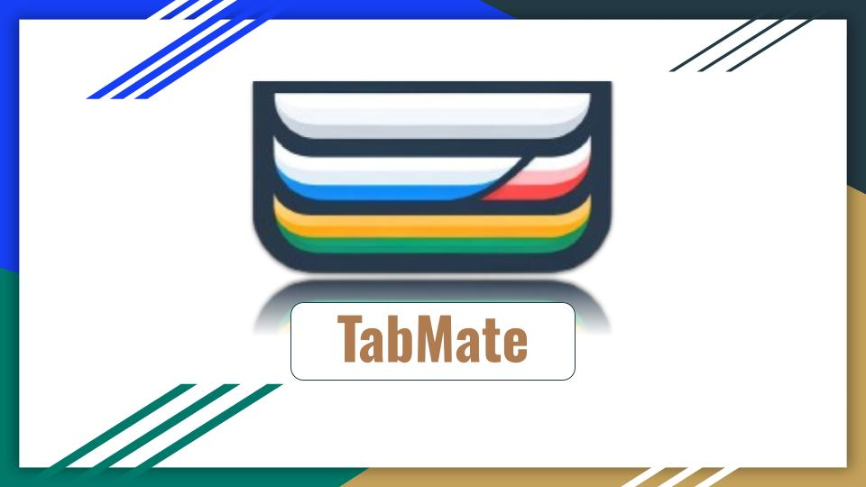

# TabMate: Your Smart AI-Powered Tab Manager 🧠✨

TabMate is an intelligent Chrome extension that transforms the way you manage browser tabs. Powered by the Google Prompt AI for Gemini Nano, TabMate offers seamless tab organization with the simplicity of natural language. Whether you're juggling countless tabs or trying to stay focused, TabMate's AI is here to help you group, reopen, close, and navigate tabs like never before.

---

## 🌟 Features

- **AI-Driven Tab Management**: Let TabMate intelligently group, close, or reopen tabs based on your browsing behavior and preferences.
- **Natural Language Commands**: Use simple, conversational instructions to interact with TabMate. No more clicking through endless menus.
- **Custom Shortcuts**: Define your own presets with natural language once and execute them effortlessly with a single click.
- **Future-Ready**: Voice command integration is on the horizon! 🗣️🔊
- **Privacy-First**: TabMate is completely serverless and saves only your customized shortcuts locally—your data stays with you.

---

## 🖼️ User Interface Preview

Here’s a sneak peek at TabMate’s simple yet powerful interface:

---

## 🚀 Use Cases

- **Work Mode**: Group tabs by project or task to stay organized during work sessions.
- **Focus Mode**: Close distractions in one click and reopen them later with ease.
- **Session Saver**: Save specific tab groups for future browsing sessions.

---

## 🛠️ Installation & Setup

1. Clone or download this repository to your local machine.
2. Open Chrome and navigate to `chrome://extensions/`.
3. Enable **Developer Mode** (toggle in the top-right corner).
4. Click **Load unpacked** and select the folder containing TabMate.
5. Start managing your tabs with AI power! 💡

---

## 📅 What's Next?

TabMate is just getting started! 🚧 Here’s what’s coming next:

- **Voice Commands**: Hands-free tab management through speech-to-text.
- **Enhanced AI Algorithms**: Improved grouping and customization based on user feedback.
- **Polished UI**: Refinements to the user interface for a smoother experience.

---

## ⚡️ Built With

- JavaScript, React, HTML, CSS

TabMate leverages the latest advancements in AI, bringing a smarter browsing experience directly to your fingertips.

---

## 🌟 Prototype Status

Please note: TabMate is currently a **prototype** and was developed for a Chrome AI Challenge. While fully functional, it will undergo further development to bring its features to their full potential. Stay tuned for updates! 🚀✨

---

### Your feedback is invaluable! If you’ve tried TabMate, let us know how we can improve. 🙌

